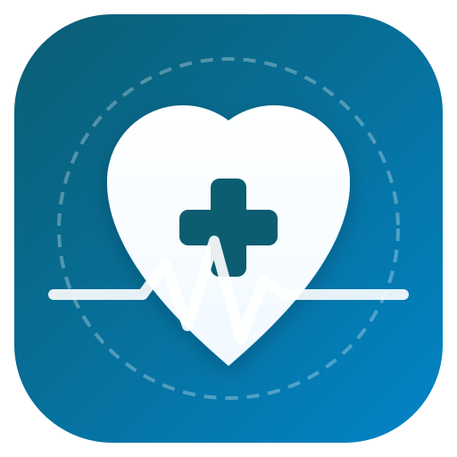

# 🩺 Medic - Doctor Appointment & Healthcare App

A high-performance, cross-platform React & Capacitor healthcare application designed and built by **Majid Ali**.



## 🌟 Key Features
- **Dual Role Access (Patient & Doctor)**: Sign up or sign in as a Patient to book visits or as a Doctor to manage incoming appointment requests in real-time.
- **Smart Doctor Search Engine**: Fast multi-keyword, case-insensitive fuzzy filtering by doctor name, specialty, hospital, city, and fee range.
- **Doctor Portal Dashboard**: Real-time incoming appointment request management (Accept/Decline) with instant status persistence.
- **Appointment History**: Track past & upcoming appointments with printable pass tickets.
- **Supabase Authentication & Storage**: Session persistence with live Supabase authentication integration and offline-first fallback.
- **Mobile Native Build Ready**: Native Android app build powered by Capacitor.

---

## 🔑 Quick Test Credentials (2-Phone Testing)

| Role | Name | Email | Password |
|---|---|---|---|
| **Patient** | Zunaira Mughal | `patient@medic.com` | `password123` |
| **Doctor (Cardiologist)** | Dr. Ahmed Ali | `dr.ahmed@medic.com` | `password123` |
| **Doctor (Dermatologist)** | Dr. Sarah Khan | `dr.sarah@medic.com` | `password123` |
| **Doctor (Neurologist)** | Dr. Muhammad Hassan | `dr.hassan@medic.com` | `password123` |
| **Doctor (Pediatrician)** | Dr. Ayesha Malik | `dr.ayesha@medic.com` | `password123` |

---

## 🛠️ Technology Stack
- **Frontend Framework**: React 19 + Vite
- **Styling**: Vanilla CSS with modern Glassmorphism, CSS Custom Variables, & Micro-animations
- **Icons**: Lucide React
- **Backend & Auth**: Supabase Auth + Supabase DB (`appointments` table)
- **Mobile Bridge**: Capacitor 8 (Android)

---

## 🚀 How to Run Locally

```bash
# 1. Install dependencies
npm install

# 2. Run local dev server
npm run dev

# 3. Build production web bundle
npm run build

# 4. Sync assets to Android project
npx cap sync

# 5. Launch in Android Studio
npx cap open android
```

---

## 👨‍💻 Developer & Owner
**Majid Ali**  
- **GitHub**: [https://github.com/malikmajid161](https://github.com/malikmajid161)  
- **Repository**: [https://github.com/malikmajid161/Medic-Doctor-Appointment-App](https://github.com/malikmajid161/Medic-Doctor-Appointment-App)
